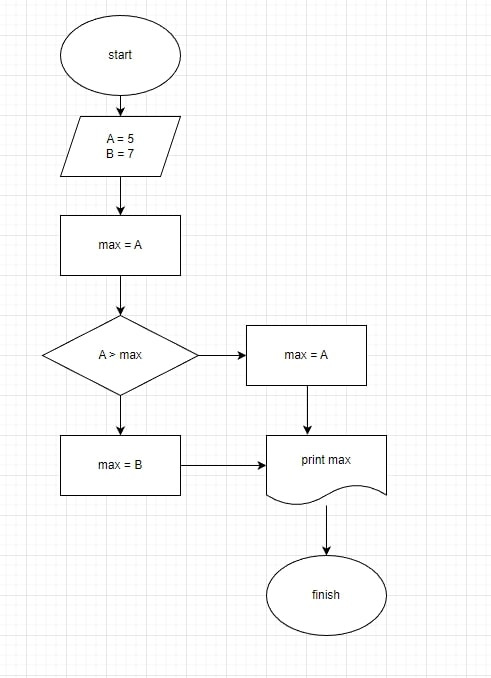
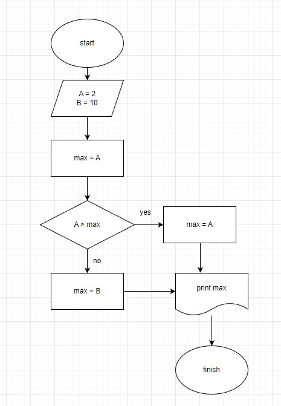
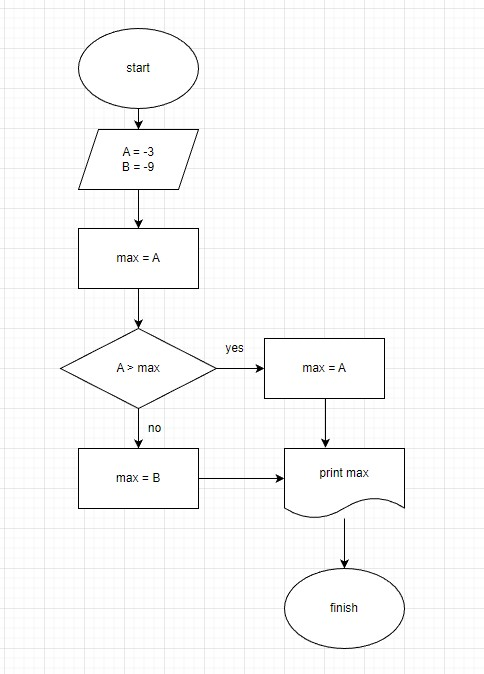
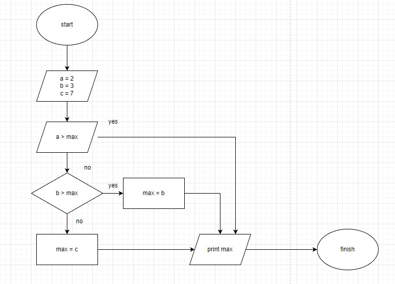
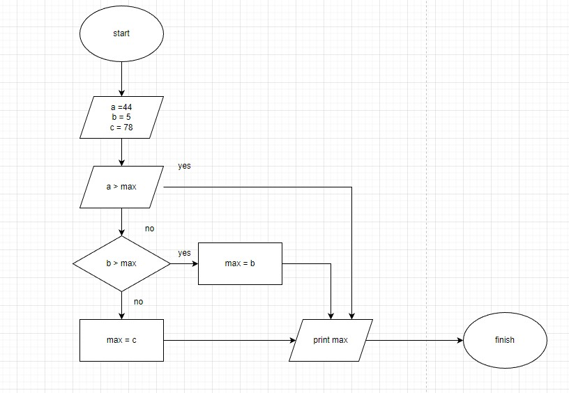
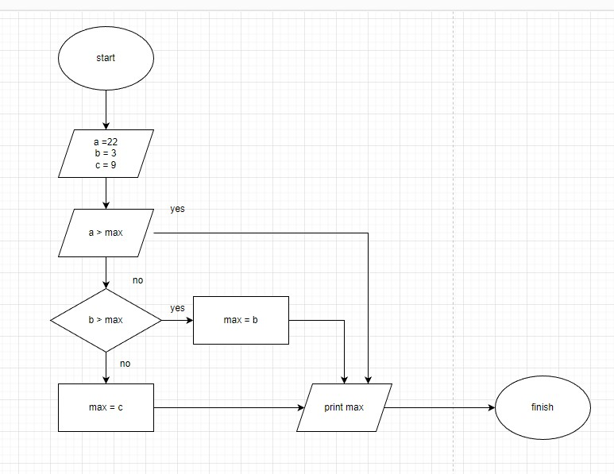

## Задача 2.1

*Напишите программу, которая на вход принимает два числа и выдаёт, какое число большее, а какое меньшее. a = 5; b = 7 -> max = 7*

**Блок-схема**

**[Код](task_2/Program.cs)**

## Задача 2.2

*Напишите программу, которая на вход принимает два числа и выдаёт, какое число большее, а какое меньшее. a = 2; b = 10 -> max = 10*

**Блок-схема**

**[Код](task_2.2/Program.cs)**

## Задача 2.3

*Напишите программу, которая на вход принимает два числа и выдаёт, какое число большее, а какое меньшее. a = -3; b = -9 -> max = -3*

**Блок-схема**

**[Код](task_2.3/Program.cs)**

## Задача 4.1

*Напишите программу, которая принимает на вход три числа и выдаёт максимальное из этих чисел. 2, 3, 7 -> 7*

**Блок-схема**

**[Код](task_4.1/Program.cs)**

## Задача 4.2

*Напишите программу, которая принимает на вход три числа и выдаёт максимальное из этих чисел. 44, 5, 78 -> 78*

**Блок-схема**

**[Код](task_4.2/Program.cs)**

## Задача 4.3

*Напишите программу, которая принимает на вход три числа и выдаёт максимальное из этих чисел. 22, 3, 9 -> 22*

**Блок-схема**

**[Код](task_4.3/Program.cs)**